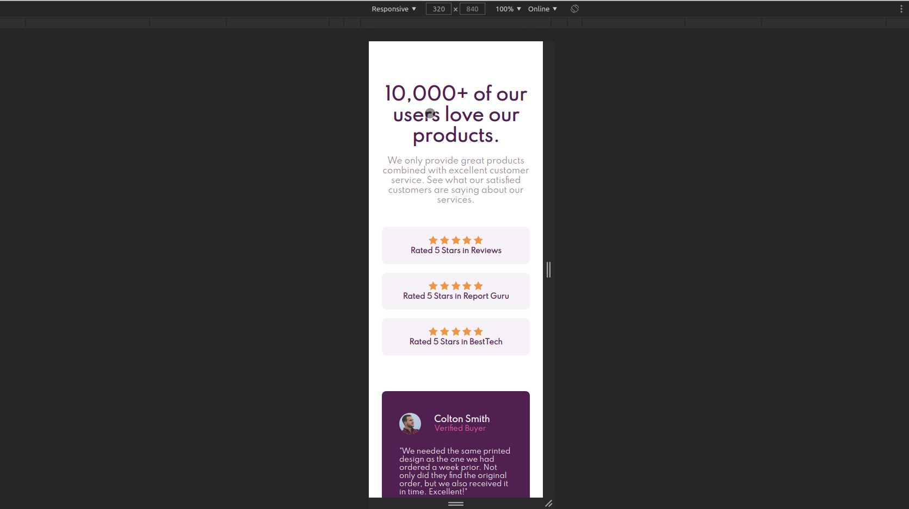

# Four Card Feature Section

The following is my genuine and personalized solution to the Frontend Mentor challenge, [Social proof section](https://www.frontendmentor.io/challenges/social-proof-section-6e0qTv_bA).

- Responsive landing-page implemented in HTML & CSS
- Developed from design assets provided by Frontend Mentor
- [Viewable Live](https://mdillemuth.github.io/social-proof-section//)

## Motivation

- To practice creating the front-end of a professional-quality design without the use of a tutorial, answer-key, or previous solution.
- To practice following a style-guide and implementing assets from a designer

## Showcase

## Technology

- HTML5
- SCSS & CSS3
